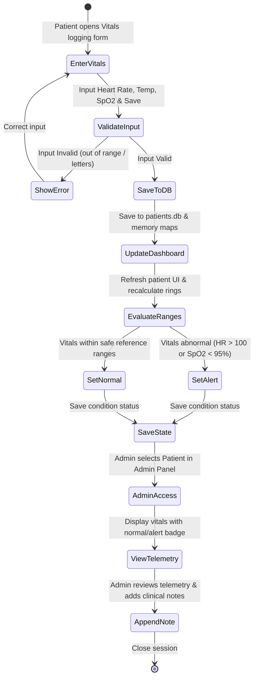
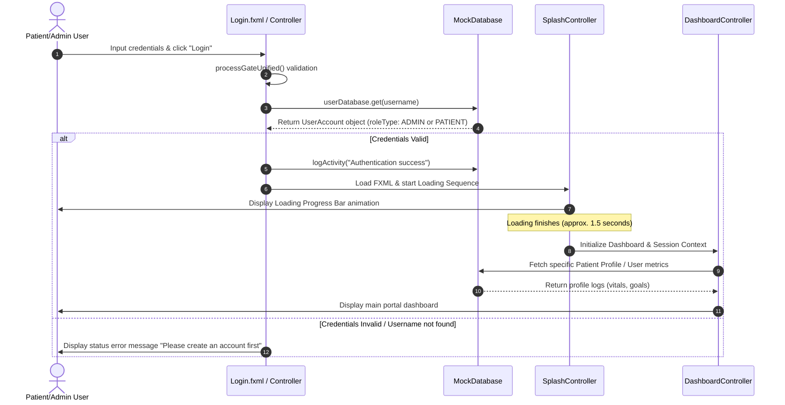
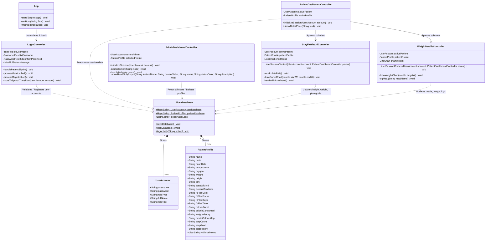

# Smart Healthcare Monitoring System
## Comprehensive Software Documentation & Technical Specifications

---

## 1. Title Page

*   **Project Title**: Smart Healthcare Monitoring System
*   **System Variant**: FinalProject (JavaFX & MVC Architecture)
*   **Document**: Technical Software Specification & Verification Manual
*   **Author**: Project Development Team
*   **Date**: May 2026

---

## 2. Introduction

The **Smart Healthcare Monitoring System** is a desktop application designed to bridge the gap between patient self-logging and clinical monitoring. By combining a personal health portal with an administrator dashboard, the system allows users to track their vitals, nutrition, sleep, and fitness goals, while providing clinicians with system-wide analytics, alert states, and individual charts. 

The application utilizes a **Model-View-Controller (MVC)** architectural pattern built on **JavaFX** for the interface and utilizes flat-file databases for simple, local data persistence. The design adheres strictly to the **Apple Human Interface Guidelines (HIG)**, incorporating vibrant color gradients, card layouts, clean typography, and circular activity ring progress bars.

---

## 3. Objectives

*   **Self-Logging Enablement**: Provide users with a clean interface to log weight, daily meals, heart rate, body temperature, blood oxygen levels, sleep cycles, steps, and mental states.
*   **Clinical Diagnostics**: Equip administrators with read-only monitors to observe telemetry metrics, check warning alerts for abnormal readings, and append clinical notes directly to patient charts.
*   **Data Integrity & Validation**: Prevent fat-finger entries by restricting input fields (e.g. realistic weight limits, digit validations for phones, character constraints on emails).
*   **High-Aesthetic Interface**: Implement modern UI design, using Segoe UI Emoji support, color-coded status badges, and canvas-drawn gauges.

---

## 4. Scope and Limitations

### Scope
*   **Desktop Client**: JavaFX application compiling on JDK 21+ with Maven.
*   **Role-Based Access**: Dual login gates routing patients and administrators to distinct dashboards.
*   **Telemetry Logs**: Real-time canvas rendering of calorie deficit gauges, manual calorie logging mapped by meal type (breakfast, lunch, dinner), and historical trend charts for heart rate, blood oxygen, and weight.
*   **Clinical Intervention**: Clinical note-taking module allowing admins to append overrides onto patient profiles.
*   **Account Management**: Administration suite allowing deletion of profiles and corresponding login credentials.

### Limitations
*   **Local Persistence**: Flat files are stored locally (`users.db` and `patients.db`); no remote database server or network API is integrated.
*   **Self-Logged Vitals**: Telemetry relies on manual data input rather than real-time sensor integration.
*   **Single Session**: No support for concurrent multi-user database write operations.

---

## 5. System Features

*   **Unified Login Gate**: Validates usernames and passwords against `users.db`. Registers new patient accounts and seeds default profile schemas in `patients.db`.
*   **Apple HIG Sidebar**: Collapsible navigation sidebar using stack-pane gradient icons and font styling matching Apple's SF Pro aesthetic.
*   **Activity Rings**: Three concentric progress arcs displaying Move (calories), Exercise (minutes), and Stand (hours) targets.
*   **Stay Fit Plan Wizard**: A multi-step setup form that calculates Body Mass Index (BMI), visualizes projected weight curves, and stores exercise frequency.
*   **Daily Calorie Gauge**: A custom-drawn semi-circular color gauge indicating calorie deficits based on food intake and calorie burn.
*   **Admin Analytics Suite**: Real-time statistics detailing patient counts, active alerts for abnormal vitals, average heart rates, and symptom distributions.
*   **Clinical Telemetry Monitors**: Modals in the admin portal comparing resting heart rate, oxygen levels, and temperature records against normal physiological reference ranges.

---

## 6. UML Diagrams

### Use Case Diagram

```mermaid
graph TD
    User([Patient / User]) --> UC1(Log In / Register)
    User --> UC2(Log Vitals: HR, Temp, SpO2)
    User --> UC3(Log Weight & Meals)
    User --> UC4(Log Sleep & Mood)
    User --> UC5(Configure Stay Fit Plan)
    User --> UC6(View Dashboard / History)
    
    Admin([Admin / Clinician]) --> UC1
    Admin --> UC7(View System Analytics)
    Admin --> UC8(View Global Diagnostic Logs)
    Admin --> UC9(Monitor Patient Demographics & Vitals)
    Admin --> UC10(Append Clinical Notes)
    Admin --> UC11(Delete Patient Accounts)
    
    classDef actor fill:#FFE6E6,stroke:#FF3B30,stroke-width:2px;
    classDef uc fill:#E6F2FF,stroke:#0071E3,stroke-width:1.5px;
    class User,Admin actor;
    class UC1,UC2,UC3,UC4,UC5,UC6,UC7,UC8,UC9,UC10,UC11 uc;
```

### Activity Diagram (Vitals Logging & Alert Workflow)

### Sequence Diagram (Authentication & Routing Flow)

### Class Diagram

---

## 7. Database Design

The application utilizes local flat-file storage with two database files using custom triple-pipe `|||` delimiters.

### 7.1 `users.db` Schema
Stores user authentication profile data.

| Field Index | Field Name | Data Type | Description |
| :--- | :--- | :--- | :--- |
| 0 | `username` | String (Primary Key) | Unique profile identifier used during login. |
| 1 | `password` | String | Account password credentials. |
| 2 | `roleType` | String | User role identifier: `PATIENT` or `ADMIN`. |
| 3 | `fullName` | String | Full name displayed on dashboard headers. |
| 4 | `roleTitle` | String | Official position title (e.g. Chief Medical Officer). |

*Record Example*:
`admin|||admin123|||ADMIN|||Admin|||Chief Medical Officer`

### 7.2 `patients.db` Schema
Stores clinical diagnostics and metric history.

| Field Index | Field Name | Data Type | Description |
| :--- | :--- | :--- | :--- |
| 0 | `name` | String (Primary Key) | The patient's full name. |
| 1 | `meta` | String | Status/Location tags (e.g. `"Ward B, Bed 4"`). |
| 2 | `heartRate` | String | Current resting heart rate (BPM). |
| 3 | `temperature`| String | Current body temperature (°C). |
| 4 | `oxygen` | String | Blood oxygen saturation levels (% SpO2). |
| 5 | `weight` | String | Body weight weight record (kg). |
| 6 | `sleepHours` | String | Daily sleep duration hours. |
| 7 | `sleepMinutes`| String | Daily sleep duration minutes. |
| 8 | `moveCal` | String | Current active active burnt calories (kcal). |
| 9 | `exerciseMin`| String | Current active exercise duration (minutes). |
| 10 | `standHr` | String | Current active standing hours. |
| 11 | `height` | String | Patient height (cm). |
| 12 | `bmi` | String | Body Mass Index value. |
| 13 | `stateOfMind`| String | Text description of mood. |
| 14 | `stateOfMindBadge` | String | Mood category badge (e.g. Relaxed). |
| 15 | `fitPlanGoal`| String | Target goal weight (kg). |
| 16 | `fitPlanFocus`| String | Stay Fit Plan focus areas. |
| 17 | `fitPlanDays`| String | Stay Fit schedule training days. |
| 18 | `fitPlanTime`| String | Stay Fit notification alert time. |
| 19 | `calorieBurnt`| String | Current daily baseline calorie burn. |
| 20 | `calorieConsumed`| String | Current daily calorie intake (kcal). |
| 21 | `weightHistory`| String | Comma-separated weights history list. |
| 22 | `mealsCalorieMap`| String | Semicolon-separated meals log (e.g. `breakfast=340;...`). |
| 23 | `stepCount` | String | Current daily steps taken. |
| 24 | `stepGoal` | String | Daily steps target goal. |
| 25 | `stepHistory`| String | Comma-separated steps history list. |
| 26 | `heartRateMinMaxRange` | String | Target heart rate bounds (e.g. 60-100). |
| 27 | `heartRateHistory` | String | Comma-separated heart rate logs. |
| 28 | `age` | String | Patient numeric age. |
| 29 | `gender` | String | Patient gender. |
| 30 | `bloodType` | String | Patient ABO blood type. |
| 31 | `phone` | String | Patient contact phone number. |
| 32 | `email` | String | Patient email address. |
| 33 | `address` | String | Patient home address. |
| 34 | `oxygenHistory`| String | Comma-separated oxygen reading logs. |
| 35 | `currentCondition`| String | Current medical condition state (e.g. Healthy). |
| 36 | `clinicalNotes`| String | Notes joined with sub-delimiter `:::`. |

---

## 8. User Interface Design

The user interface follows the **Apple Human Interface Guidelines (HIG)**, incorporating dark/light balanced values, clean rounded borders, shadow elevations, and category-focused gradient boxes:

1.  **Vibrant Gradients**: Stack-pane icons are color-coded:
    *   *Heart & Activity*: Red-to-pink gradient (`#FF2D55` to `#FF5E7E`).
    *   *Oxygen / Summary*: Light-to-dark blue gradient (`#0071E3` to `#3399FF`).
    *   *Sleep & Weight*: Indigo-to-purple gradient (`#5856D6` to `#8E2DE2`).
    *   *Condition / Diagnostics*: Teal-to-green gradient (`#34C759` to `#10B981`).
2.  **Typography**: Configured to use modern sans-serif fonts (`'Segoe UI'`, `'Inter'`, or system default) with clear font weights.
3.  **Canvas Drawing**: Dynamic deficit dial sweeps from `-800` to `+800` using a high-density graphics context.
4.  **Logging Panels**: Elegant modal popups loaded as sub-panels inside the dashboard stack.

---

## 9. Testing and Evaluation

A comprehensive test matrix checks authentication flow, input limitations, calculation algorithms, and system performance.

| Test Case ID | Test Target | Description / Input Values | Expected Result | Pass / Fail |
| :--- | :--- | :--- | :--- | :--- |
| **TC-01** | Login Auth | Valid patient account credentials. | Successful redirect to patient portal. | Pass |
| **TC-02** | Login Auth | Invalid credentials or blank entries. | Displays status error message in red. | Pass |
| **TC-03** | Profile Val | Age set to `135` or `-5`. | Warning popup: "Age must be between 0 and 120." | Pass |
| **TC-04** | Profile Val | Phone number set to `9171234567`. | Warning popup: "Phone number must start with 09." | Pass |
| **TC-05** | Profile Val | Email containing numbers (e.g. `u5er@mail.com`). | Warning popup: "Email must not contain numbers." | Pass |
| **TC-06** | Meal Logger | Meal calories set to `3500` kcal. | Warning popup: "Calories must be between 0 and 3000." | Pass |
| **TC-07** | Weight Log | Weight entry set to `15.0` kg. | Warning popup: "Weight must be between 20 and 300 kg." | Pass |
| **TC-08** | Plan Wizard | Height set to `175` cm, weight `75` kg. | BMI calculated as `24.5` (Normal, Green Badge). | Pass |
| **TC-09** | Vitals Log | SpO2 input set to `94`%. | Mapped to abnormal alert. Admin displays warning state. | Pass |
| **TC-10** | Event Logs | Perform telemetry reset. | Event added to audit: "All activity and data input reset." | Pass |
